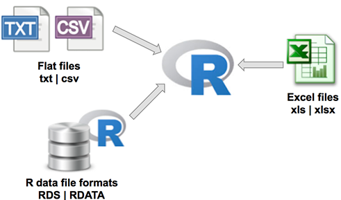
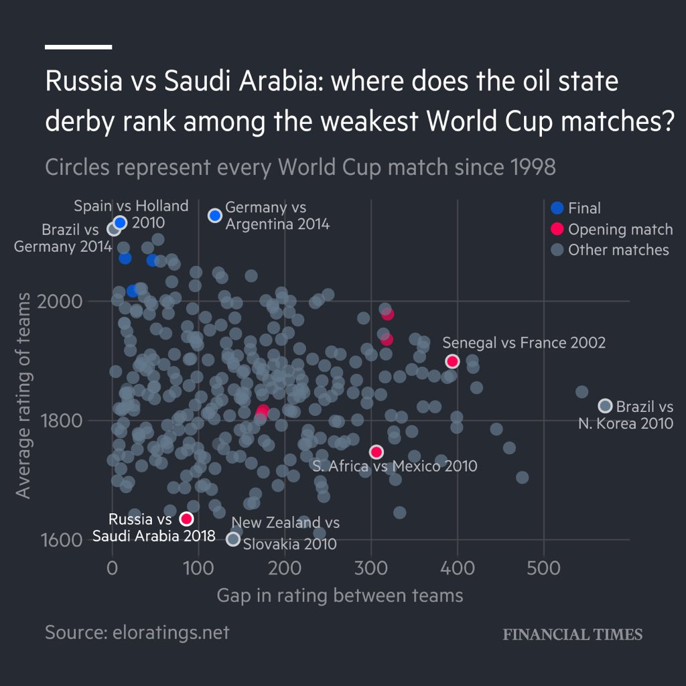
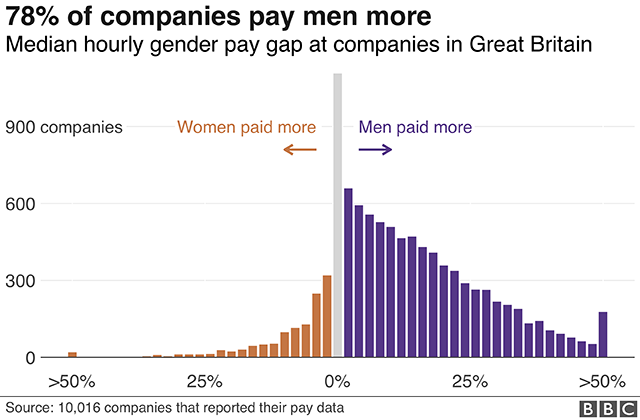
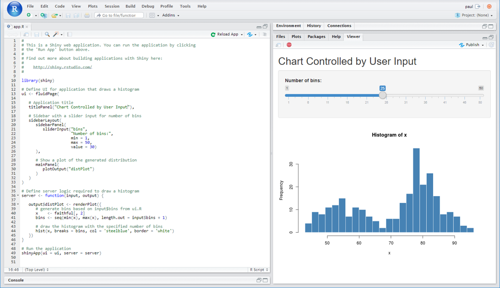

<base target="_blank">

```{r setup, include=FALSE, cache=FALSE}
options(htmltools.dir.version = FALSE)

knitr::opts_chunk$set(
  message = FALSE,
  warning = FALSE,
  dev = "svg",
  cache = TRUE,
  cache.path = ".cache/",
  fig.align = "center"
  #fig.width = 11,
  #fig.height = 5
)

library(tidyverse)
library(hrbrthemes)
library(glue)

theme_set(
  theme_minimal(base_family = "Fira Code") + 
    theme(plot.background = element_rect(fill = "#FAFAFA", color = NA),
          panel.background = element_rect(fill = "#FAFAFA", color = NA)
          )
  )
```

class: inverse, middle, center

# Why R?

---

# R

.pull-left[

- R is a programming language built for data analysis and visualisation

- It's 'open-source' which means it is completely free to use

- Developed and maintained by an active not-for-profit team of software engineers and developers

- This means it is always growing and improving with over 11,000 R 'packages' freely available to use

- Highly flexible - adapt to suit your own needs without the constraints of proprietary software

- Community - welcoming community of R users online (#rstats) always happy to help and make it fun for you to learn

]

.pull-right[

]
---

# R vs Excel

.pull-left[

But I'm already an Excel wizard, why do I need R?

- As the importance and abundance of data increases, so does the complexity of the data tasks we're asked to fulfill

- Doing complex tasks with large data volumes in Excel is...Difficult!

- Learning to programme these tasks with R will:
  * reduce human error
  * allow you to work with larger datasets
  * make your analysis more transparent and reproducible
  * automate the boring repetitive parts
  * save you **so much time**

]

.pull-right[

Source: [Gordon Shotwell](https://blog.shotwell.ca/2017/02/02/r-for-excel-users/)
]

???

Excel has long been the industry-standard tool for working with data but it's limitations are becoming more and more apparent as data volumes increase as well as the demand for accuracy and reproducibility in data analysis

---

# R vs Python

But isn't python the best for this type of stuff?

.pull-left[

- Python is also a great language for data analysis, but it's scope extends way beyond this and is generally better suited to people with computer science backgrounds

- If you're interested in learning to code with the end goal of harnessing AI and deploying machine learning models in large-scale production environments - choose python!

- If your primary objective is to get better at manipulating and visualisation data, and communicating the results in reports and interactive dashboards - R is your new best friend (examples to come)

]

.pull-right[

]

---

class: inverse, middle, center

# The R Workflow


Source: [R for Data Science](http://r4ds.had.co.nz)

---

class: inverse, middle, center

# Importing

---

# Importing Data

.pull-left[

R can import data from just about every form imaginable:

- Flat files like plain text and delimited data: .txt, .csv, .tsv

- Data files from proprietary software like MS Excel, SPSS, SAS

- Directly from Databases: MySQL, MS SQL Server, PostgreSQL

- Directly from the Web: APIs, JSON, Webscrape HTML

]

.pull-right[

]

---

# Importing Data - CSV

```{r}
library(tidyverse) # load full suite of packages for data analysis

london_crime <- read_csv("data/london_crime.csv") # import london violent crime data

london_crime # preview the data
```

---

# Importing Data - Multiple Excel Sheets to 1 Data Frame

<iframe width="100%" height = "500px" src="https://view.officeapps.live.com/op/view.aspx?src=https%3A%2F%2Fwww.cultureofinsight.com%2Fdata%2Fgapminder_messy.xlsx" scrolling="yes" frameborder="no"></iframe>

---

# Importing Data - Multiple Excel Sheets to 1 Data Frame

.pull-left[
```{r excel-to-df, eval=FALSE}
library(readxl)

path <- "data/gapminder_messy.xlsx"

combined_data <- excel_sheets(path) %>% 
  map_df(~ {
    read_excel(path, sheet = .x, 
               skip = 4, trim_ws = TRUE) %>% 
      mutate(year = as.numeric(.x))
  }) %>% 
  select(country, year, everything())

# show top and bottom 6 rows of data frame
head(combined_data)
tail(combined_data)
```
]

.pull-right[
```{r excel-to-df-out, ref.label="excel-to-df", echo=FALSE}
```
]

---

# Importing Data - SPSS

You don't have to pay expensive SPSS licenses to analyse your survey data!

```{r spss_import}
library(haven) # for reading SPSS, SAS, STATA files

survey_data <- read_sav("data/sample_spss_data.sav")

head(survey_data)
```

---

# Importing Data - SPSS

```{r}
# convert spss label codes into labels
labelled_survey_data <- as_factor(survey_data)

head(labelled_survey_data)
```

---

# Importing Data - SPSS

Quickly get some summary stats about your respondents...

```{r}
labelled_survey_data %>% 
  count(fQ1bGender, dAge) %>% 
  spread(fQ1bGender, n) %>% 
  knitr::kable(format = "html")
```

---

# Importing Data - Databases

```{r}
library(DBI)

con <- dbConnect(
  drv = RMySQL::MySQL(),
  dbname = "shinydemo",
  host = "shiny-demo.csa7qlmguqrf.us-east-1.rds.amazonaws.com",
  username = "guest",
  password = "guest"
)

dbListTables(con)
```

---

# Importing Data - Databases

```{r}
cities <- tbl(con, "City")

cities
```

---

# Web APIs

Many R packages make it easy for you to pull publicly available data via an API (application programming interface).

The code below retrieves data from the UK police database within 1 mile of the coordinates you provide for the latest available month.

```{r}
library(ukpolice)

crime_data <- ukp_crime(lat = 51.533802, lng = -0.092715)

head(crime_data)
```


---

class: inverse, middle, center

# Manipulation

---

# Transforming Data

.pull-left[
 
]

.pull-right[
 
]


https://github.com/gadenbuie/tidy-animated-verbs

---

# Transforming Data

```{r}
# data set with details of every tree in paris (1 row = 1 tree)
trees_in_paris <- read_csv2("data/les-arbres.csv") 

colnames(trees_in_paris) # how's your french?
```

Can we answer the question...

> How many trees does each Arrondissement have, and what century were they planted in?

We only need 2 columns from the raw data to answer this...

---

# Transforming Data

```{r}
transformed_trees <- trees_in_paris %>% 
  select(ARRONDISSEMENT, DATEPLANTATION) %>%                # select only Arr. and Date Planted cols
  mutate(year = lubridate::year(DATEPLANTATION),            # pull year number from full date
         century_planted = case_when(                       #
           year < 1700 ~ "17th",                            #
           year < 1800 ~ "18th",                            #
           year < 1900 ~ "19th",                            # code a century planted column
           year < 2000 ~ "20th",                            # based on year number
           year < 2018 ~ "21st",                            #
           is.na(year) ~ "Unknown"                          #
           )                                                #
         ) %>%                                              #
  count(ARRONDISSEMENT, century_planted) %>%                # count the number of trees by Arr. & Century
  group_by(ARRONDISSEMENT) %>%                              # group the data by Arr.
  add_tally(n) %>%                                          # add column with total trees for each Arr.
  ungroup() %>%                                             # ungroup the data
  spread(century_planted, n) %>%                            # spread centuries from rows to columns
  select(1, 3:8, Total = nn) %>%                            # reorder and rename columns
  arrange(desc(Total))                                      # sort data by total column
```

---

# Results...

The 16th Arrondissement has the most trees in Paris! Most of which were planted in the 18th Century.

```{r}
transformed_trees
```

---

# Joining Data

```{r}
co2 <- read.table("ftp://aftp.cmdl.noaa.gov/products/trends/co2/co2_annmean_mlo.txt") %>% 
  as_tibble() %>% 
  select(Year = V1, CO2 = V2)

temp <- read.table("https://go.nasa.gov/2r8ryH1") %>% 
  as_tibble() %>% 
  select(Year = V1, `Global Land-Ocean Temperature Index` = V2)
```

.pull-left[
```{r echo=FALSE}
co2
```
]

.pull-right[
```{r echo=FALSE}
temp
```
]

---

# Joining Data

.pull-left[
 
]

.pull-right[

To look for a relationship between each dataset we want to join them but only keep years for which there is both CO2 and Global Temperature data.

```{r}
joined_data <- inner_join(co2, temp, by = "Year")

joined_data
```
]

---

# Plot the Relationship...

```{r fig.height=4}
ggplot(joined_data, aes(x = CO2, y = `Global Land-Ocean Temperature Index`)) +
  geom_point() +
  geom_smooth() +
  labs(caption = "Source: NOAA, NASA")
```

---

class: inverse, middle, center

# Visualisation

---

# ggplot2

.pull-left[
- Combine your data wrangling and chart making into one single process
  * no more pasting data from excel into powerpoint to make or change a chart! `r emo::ji("raised_hands")`

- Makes it easy to quickly iterate over different ways of mapping your data to shapes, space and colour

- Programming a chart with code forces you to think about what you are doing and why

- Allows you to create completley unique charts by adding several different 'layers' of data

- Not constrained by the chart types available in other software packages

- Produce publication quality graphics just like...
]

.pull-right[

]

---

# Financial Times

.pull-left[
<blockquote class="twitter-tweet" data-lang="en"><p lang="en" dir="ltr">Fun fact for the <a href="https://twitter.com/hashtag/dataviz?src=hash&amp;ref_src=twsrc%5Etfw">#dataviz</a> crowd:<br><br>This chart (and the ones in the story) are the first we&#39;ve done 100% in ggplot, right down to the custom <a href="https://twitter.com/FT?ref_src=twsrc%5Etfw">@FT</a> font and the white bar in the top left. <a href="https://t.co/BVFmoYX2WL">https://t.co/BVFmoYX2WL</a></p>&mdash; John Burn-Murdoch (@jburnmurdoch) <a href="https://twitter.com/jburnmurdoch/status/1006783615022391297?ref_src=twsrc%5Etfw">June 13, 2018</a></blockquote>
<script async src="https://platform.twitter.com/widgets.js" charset="utf-8"></script>
]


.pull-right[

]

---

# BBC

<blockquote class="twitter-tweet" data-conversation="none" data-cards="hidden" data-lang="en"><p lang="en" dir="ltr">At the beeb we’re now doing a lot of charts solely in ggplot. The charts here for example <a href="https://t.co/bokQHQK6pj">https://t.co/bokQHQK6pj</a> .  We’re doing maps too.</p>&mdash; Wesley Stephenson (@WesStephenson) <a href="https://twitter.com/WesStephenson/status/1006797669648470016?ref_src=twsrc%5Etfw">June 13, 2018</a></blockquote>
<script async src="https://platform.twitter.com/widgets.js" charset="utf-8"></script>

.center[

]

---

# ggplot2 - Example

```{r}
london_crime <- london_crime %>% # use london crime data previously imported
  gather(year, rate, 3:ncol(.))  # gather the year columns to key + value columns (wide to long data)

london_crime
```
---

# ggplot2 - Example

```{r london_facet, fig.height=4, fig.width=8}
plot_years <- unique(london_crime$year)
p <- ggplot(london_crime, aes(year, rate, group = Borough)) +
  geom_line(colour = "SteelBlue") +
  scale_x_discrete(breaks = plot_years[seq(1, length(plot_years), by = 2)]) +
  labs(x = "Year", y = "Rate per Thousand Population", title = "Violent Crime Trends by London Boroughs",
       caption = "Source: data.gov.uk")
p
```

---

# Facets

.left-column[
```{r london_facet2, eval=FALSE}
p + 
  facet_wrap(~ Borough) + 
  scale_x_discrete(breaks = NULL) +
  scale_y_continuous(breaks = c(10, 30, 50)) +
  labs(x = NULL, subtitle = "1999-00 - 2015-16") +
  theme(strip.text.x = element_text(size = 6))
```
]

.right-column[
```{r london_facet2_out, echo=FALSE, fig.height=5, ref.label="london_facet2"}
```
]

---

# Geo Facets

.left-column[

Switch `facet_wrap` to `facet_geo` with the `geofacet` package to arrange facets in a geographically ordered grid.

```{r london_facet3, eval=FALSE}
library(geofacet)
p +
  facet_geo(~ Borough, grid = "london_boroughs_grid") +
  scale_x_discrete(breaks = NULL) +
  scale_y_continuous(breaks = c(10, 30, 50)) +
  labs(x = NULL, subtitle = "1999-00 - 2015-16") +
  theme(strip.text.x = element_text(size = 6))
```
]

.right-column[
```{r london_facet3_out, echo=FALSE, fig.height=5, ref.label="london_facet3"}
```
]

---

# Joy Plots

```{r joy-plot, eval=FALSE}
library(ggridges)

ggplot(london_crime, aes(x = rate, y = factor(year) %>% fct_rev(), fill = ..x..)) +
  geom_density_ridges_gradient(scale = 3, rel_min_height = 0.01, colour = "white") +
  viridis::scale_fill_viridis(name = "Rate", option = "C") +
  labs(y = NULL, title = 'Distribution of Violent Crime Rate in London Boroughs',
       subtitle = "Rate per Thousand Population", caption = "Source: London Data Store") +
  theme_ft_rc()
```

---

# Joy Plots

```{r jpy-plot-out, echo=FALSE, fig.height=6, fig.width=10, ref.label="joy-plot"}
```

---

# Maps

```{r }
library(sf)

# join london borough shapefile to data and filter to latest year
ldn_shape <- st_read("data/ldnb/London_Borough_Excluding_MHW.shp", quiet = TRUE) %>%
  st_transform(4326) %>% 
  inner_join(london_crime, by = c("GSS_CODE" = "Code")) %>% 
  filter(year == "2015-16")

ldn_map <- ggplot(ldn_shape) +
  geom_sf(aes(fill = rate), colour = "#FAFAFA") +
  coord_sf(datum = NA) +
  scale_fill_viridis_c(name = "Rate per Thousand Population", 
                       guide = guide_colourbar(title.position = "top",
                                               barwidth = 13, 
                                               barheight = 0.5)) +
  theme(legend.position = c(0.8, 1.05), legend.direction = "horizontal") +
  labs(title = "Violent Crime in London", subtitle = "2015-16", caption = "Source: London Data Store")
```

---

# Maps

```{r echo=FALSE, fig.height=6.1, fig.width=7}
ldn_map
```

---

# Interactive Graphics

As well as static graphics with `ggplot2`, [`htmlwidgets`](https://www.htmlwidgets.org/) bring the best of JavaScript data visualisation to R.

A few lines of R code can produce rich interactive charts and maps that you can embed in reports and dashboards.

For example, Plotly allows you to convert a static ggplot to an interactive graphics with one line!

```{r}
# make the same london crime ggplot as before with added html tooltip aesthetic
# then convert to plotly js chart
library(plotly)
library(glue)

p <- ggplot(london_crime, aes(year, rate, group = Borough, 
                              text = glue("<b>{Borough}</b><br>Year: {year}<br>Rate: {round(rate, 2)}"))) +
  geom_line(colour = "SteelBlue") +
  scale_x_discrete(breaks = plot_years[seq(1, length(plot_years), by = 2)]) +
  labs(x = "Year", y = "Rate per Thousand Population", title = "Violent Crime Trends by London Boroughs")

p_i <- ggplotly(p, tooltip = "text")
```

Chart on the next slide!

---

# ggplot2 -> Ploty JS

```{r echo=FALSE}
p_i <- p_i %>% config(displayModeBar = FALSE)

htmlwidgets::saveWidget(p_i, file = "plotly_example.html", libdir = "libs", 
                        selfcontained = FALSE, background = "#FAFAFA")
```

<iframe src="plotly_example.html" width=100% height=550 frameborder="no"></iframe>

---

# Leaflet

We can use the previously merged london borough shapefile and violent crime data to make an interactive leaflet map like so...

```{r cache=FALSE}
library(leaflet)

pal <- colorNumeric("viridis", NULL)

ldn_map_i <- leaflet(ldn_shape) %>% 
  addProviderTiles("CartoDB.Positron") %>%
  addPolygons(
    fill = ~rate, fillColor = ~pal(rate), fillOpacity = .6,
    label = ~glue("<b>{Borough}</b><br>Year: {year}<br>Rate: {round(rate, 2)}") %>% lapply(htmltools::HTML), 
    stroke = TRUE, color = "#FAFAFA", weight = 1, smoothFactor = 0
  ) %>% 
  addLegend(pal = pal, values = ~rate, opacity = 1.0, title = "Crime<br>Rate")
```

---

# Leaflet

```{r echo=FALSE, cache=FALSE}
htmlwidgets::saveWidget(ldn_map_i, file = "leaflet_example.html", libdir = "libs", 
                        selfcontained = FALSE, background = "#FAFAFA")
```

<iframe src="leaflet_example.html" width=100% height=550 frameborder="no"></iframe>

---

# Highcharts

```{r}
library(highcharter)
library(treemap) 
data(GNI2014) # world gross national income data

# 2-tiered treemap with one line of code
treemap <- hctreemap2(GNI2014, c("continent", "iso3"), size_var = "population", color_var = "GNI")
```

```{r echo=FALSE}
htmlwidgets::saveWidget(treemap, file = "hc_example.html", libdir = "libs", 
                        selfcontained = FALSE, background = "#FAFAFA")
```

<iframe src="hc_example.html" width=100% height=400 frameborder="no"></iframe>

---

class: inverse, middle, center

# Communication

---

# Communication

.pull-left[

All your coding is only going to be useful if you can effectively communicate the findings to a broader audience of stakeholders, in formats they are comfortable with.

This is where R really excels above other programming languages:

- [`rmarkdown`](https://rmarkdown.rstudio.com/) is an authoring format that enables the easy creation of dynamic documents, presentations, and reports from R. It combines the core syntax of markdown (an easy to write plain text format) with embedded R code chunks that are run so their output can be included in the final document

- [`Shiny`](https://shiny.rstudio.com/) makes it possible to build fully interactive web-apps and dashboards that puts the analytical and graphical power of R at the fingertips of your users in elegant, browser-based user interfaces

]

.pull-right[


]

---

# Rmarkdown

Combining narrative and commentary with code in a single document is a very powerful concept. It makes your report fully **reproducible**. That is, a script you can simply re-run whenever your data or code changes and all data-driven R outputs will update automatically in your report. No more copy & pasting data around various MS Office programs!*

The output options enables you to share your analysis in the format your audience is most comfortable with, be it:

- HTML Report (enables the use of interactive graphics)
- HTML Slideshow (this entire slideshow is written in rmarkdown!)
- PDF Report
- MS Word Document
- MS PowerPoint Slides
- Dashboards
- Websites - [cultureofinsight.com](https://cultureofinsight.com) is written in rmarkdown

Having your report as an executable R script also allows you to paramaterise some variables and automate the generation of several different reports - one for each subset of a data set, for example.

.footnote[
*[Check out this video](https://www.youtube.com/watch?v=s3JldKoA0zw) for a better illustration of the problem and solution to traditional data reporting methods.
]

---

# Rmarkdown


.center[
Example of the code and output of an html rmarkdown report
]

---

# Shiny

Shiny goes a step further and allows end-users to interact with a live R session through a user-interface, giving them the power of R without any required knowledge of coding.

Shiny dashboards are significantly more powerful than expensive off-the-shelf dashboard software that are limited to visualising the data you supply to them with their own charting libraries. Shiny can draw on the vast eco-system of open-source technology, dynamically run any type of R code you want it to, and feed the results back to the end-user. 

#### Example Use Case

- fetch some live google analytics data
- merge it with some internal market research data
- run a model to calculate whether a recent marketing campaign drove a significant increase in web traffic
- visualise the results to the user in interactive charts
- give them the option of downloading an auto-generated rmarkdown PDF report

And there's no limitations on the look and feel of your app. There's lots of great CSS themes to choose from, or if you know some HTML + CSS you can build a complety bespoke user interace interface from the ground-up.

Check out some of the shiny apps we've made over on the Culture of Insight [portfolio page.](https://cultureofinsight.com/portfolio)

---

# Shiny



.center[
Example of the code and output of basic shiny app
]

---

class: inverse, middle, center

# Learning

---

# Learning

We hope this has inspired you to start learning some R!

We're currently offering a 1-day "Introduction to R" course to get people started on their journey to data programming nirvana.

The course will teach you how to import, collate, join, and transform datasets with the tidyverse packages in the RStudio IDE. 

This will provide the base knowledge you need to:

- Liberate you from the constraints of Excel
- Elimate human error in your work by automating your data tasks with R scripts
- Free-up time to focus on insight, not data wrangling

You can extend your training to focus on topics like:

- Data visualisation with `ggplot2`
- Automated reporting with `rmarkdown`
- Web-application development with `shiny`

Head over to our [eventbrite page](https://www.eventbrite.co.uk/e/master-data-with-code-tickets-50351709318) to sign up, or [get in touch here](https://cultureofinsight.com/training) if you'd like to know more!

---

class: inverse, middle, center, contact-links

# Thank you!

[cultureofinsight.com](https://cultureofinsight.com/)

twitter: [@paulcampbell91](https:/twitter.com/paulcampbell91)

github: [paulc91](https://github.com/PaulC91)

linkedin: [paul campbell](https://www.linkedin.com/in/paul-campbell-792425123/)
